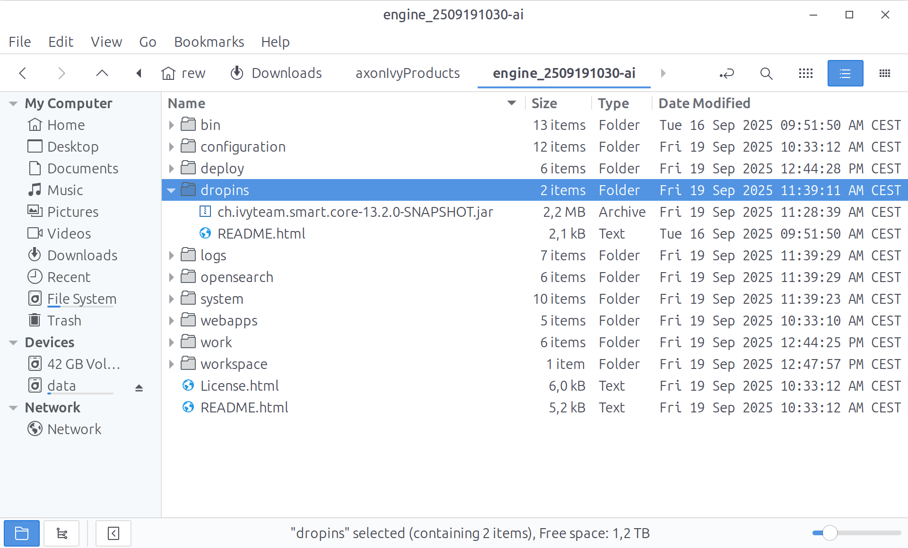
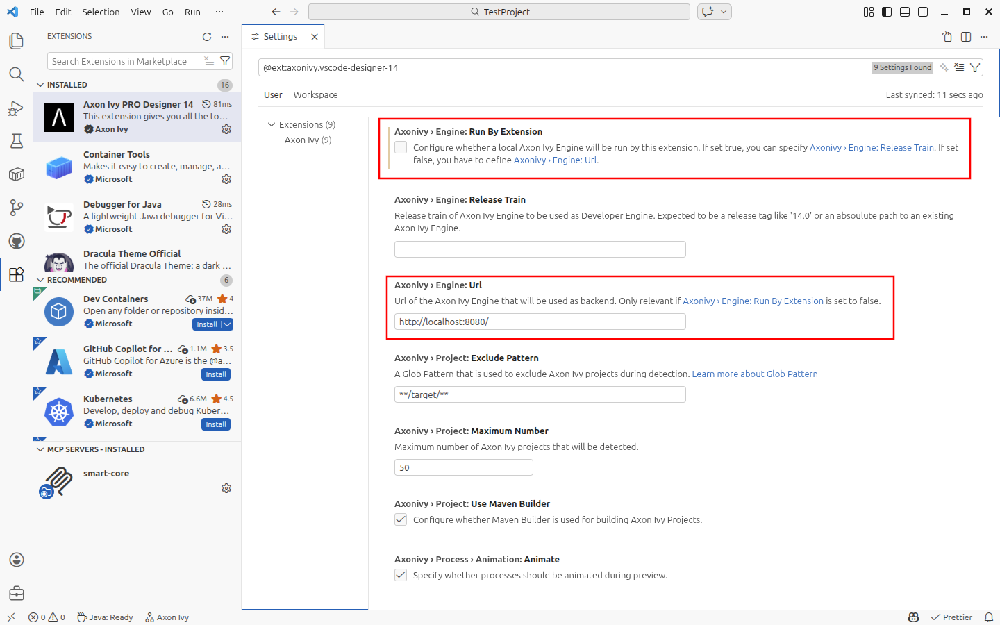
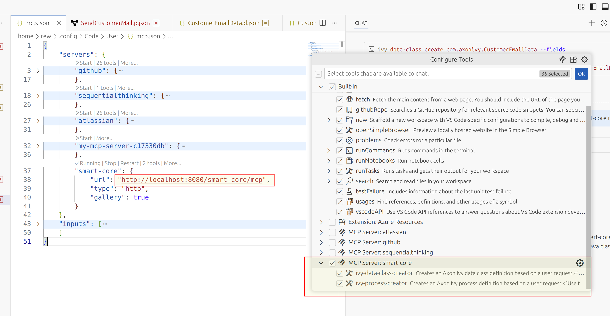

# Installation Guide


## Engine
1. Download a fresh 13.2 [nightly](https://developer.axonivy.com/download/nightly) engine and unpack it to a directory of choice.
2. Download the latest smart-core.jar from the [releases](https://github.com/axonivy/smart-core/releases) page.
3. Copy the downloaded .jar into the `dropins` directory of your engine .

## VS-Code

### Designer extension
1. [Downlod](https://code.visualstudio.com/download) the Visual Studio Code editor (1.104.1 or newer)
2. Install the Axon Ivy PRO Designer 13 (pre-release) [extension](https://marketplace.visualstudio.com/items?itemName=axonivy.vscode-designer-13).
3. Select the previously downloaded engine (with the dropin) as Engine directory when being prompted or using the 'settings' button in the extension. 

### MCP tools

1. Open the command bar (CTRL+3)
    - search and launch `MCP: Add Server...`
    - select `HTTP (HTTP or  SSE event)`
    - enter server uri: `http://localhost:8080/smart-core/mcp`
    - enter server ID: `smart-core-beta`


2. Open the Chat window in Agent mode (CTRL+SHIFT+ALT+I)
    - click on the 'hammer and wrench' icon next to your message input
    - verify that the 'smart-core' MCP server lists tools. 


3. Done, start chatting. Here's a prompt that we like to use.
    > start a process based on a signal, referencing a slack-message from a new customer.
    Add an email element, telling ceo@axonivy.com that we got a new lead!
    Use an alternative gateway, if the predicted license cost is higher than 100K dollars, create a task for PM with high priority otherwise simply end the process.


# Troubleshooting

The MCP server setup lives in the mcp.json file. After installating it should look as follows.

```json
{
	"servers": {
		"smart-core-beta": {
			"url": "http://localhost:8080/smart-core/mcp",
			"type": "http"
		}
	},
	"inputs": []
}
```